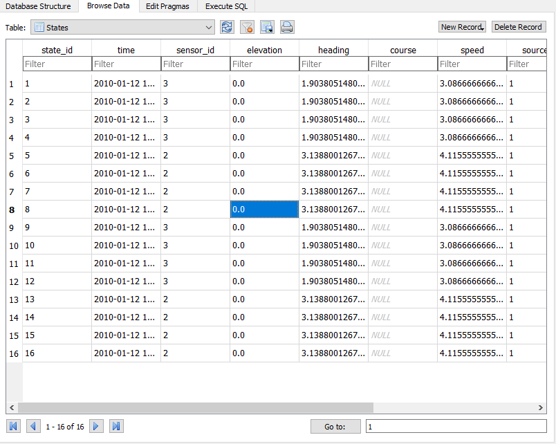

===============
Getting started
===============

This guide will take you through your first steps using Pepys - from first install, through
importing some files, to checking the contents of the database and exporting some files.

1. Download and install Pepys
-----------------------------

Follow the instructions at :doc:`installation` to install Pepys.

2. Copy configuration file
--------------------------

Copy the :code:`default_config.ini` file from the root of the Pepys installation, and place it in a
location of your choice, and rename it to :code:`pepys_config.ini`. Open the file in a text editor
and observe the configuration under the :code:`[database]` section: this configures which database
to use. Edit the :code:`db_name` section to include a full path to a database file to create - you
should ensure that this file does not already exist.

3. Set environment variable
---------------------------

Create a new environment variable called :code:`PEPYS_CONFIG_FILE`, set to the full path to the
:code:`pepys_config.ini` file that you copied in the previous step. Follow these `instructions
<https://www.computerhope.com/issues/ch000549.htm>`_ to do this, but rather than editing the
:code:`PATH` variable, choose to create a *New* variable, and configure the name and value
appropriately.

4. Run an import using Pepys Import
-----------------------------------

Navigate to the :code:`tests/sample_data/track_files/gpx` folder inside the Pepys install
folder. Right click on :code:`gpx_1_0.gpx` and in the *Send To* menu choose :code:`Pepys Import
(no archive)`. This will tell Pepys to import this GPX file into the database.

A command-line window will open, showing the Pepys welcome banner, and then the 'resolver' will
start asking you questions about bits of the data that it doesn't recognise. For example, it will
ask you to create a new datafile, and then to create a new platform - as the platform in the GPX
file wasn't in the database already. Use the number keys to choose an option each time you're asked
a question, and type in relevant responses where necessary. There is no need to give real answers at
the moment, this is just a first example.

At the end of the import, a status table will be shown. It should look like this:

.. code-block:: none

    | Table name   |   Number of rows | Last item added            |
    |--------------|------------------|----------------------------|
    | States       |                5 | 2020-04-02 14:10:59.119746 |
    | Contacts     |                0 | -                          |
    | Comments     |                0 | -                          |
    | Platforms    |                1 | 2020-04-02 14:10:54.507565 |

*Note:* The dates will be different in your example, but the number of rows should be the same.

5. Check the database status using Pepys Admin
----------------------------------------------

Run *Pepys Admin* from the Start Menu (you can either navigate to the *Pepys* folder and choose
*Pepys Admin* or just search for it and press enter).

The Pepys Admin command-line window will appear. Note that it shows the welcome banner, and states
which database it is connecting to (this should be the same database that you configured in the
configuration file). Choose option :code:`(2) Status`. Summary tables will be displayed showing the
number of rows of different types in the database: it should show that there are 5 States, plus a
single Sensor, Platform, Datafile and Change, and 15 Changes.

6. Export a data file using Pepys Admin
---------------------------------------

Now choose option :code:`(4) Export by Platform and sensor`. You will need to select a platform -
there is only one, so just press Enter. It will then give you a list of sensors and the periods they
were active. Again there is only one, so just enter :code:`1` and press Enter. Press Enter to accept
the default value for the output filename. You should then see a message saying :code:`Objects
successfully exported to exported_GPX.rep.`. Exit Pepys Admin by choosing option :code:`(0) Exit`.

If you open the file :code:`exported_GPX.rep` in a text editor, you should see contents like the
following:

.. code-block:: none

    120427 162938.000	NELSON	AA	22 11 10.63 N	021 41 52.3702 W	0	8.75	0.0
    120427 163038.000	NELSON	AA	22 17 10.63 N	021 47 52.3702 W	0	10.69	0.0
    120427 163138.000	NELSON	AA	22 29 10.63 N	021 17 52.3702 W	0	14.58	0.0
    120427 163238.000	NELSON	AA	22 11 10.63 N	021 35 52.3702 W	0	18.47	0.0
    120427 163338.000	NELSON	AA	22 23 10.63 N	021 11 52.3702 W	0	6.80	0.0

7. Import a file with errors
----------------------------

First, copy the entire :code:`track_files` folder from :code:`tests\sample_data` in the Pepys
installation folder to a safe place - as the example we're going to run will move files.

Open the Windows Command Prompt (open the *Start Menu* and type :code:`cmd` and press Enter) and
use the :code:`cd` command to navigate to the Pepys install folder. Then navigate to the :code:`bin`
directory and run :code:`set_paths.bat`. Move back to the main Pepys install folder with :code:`cd ..`,
and run the following:

.. code-block:: none

    python -m pepys_import.import --path .\tests\sample_data\track_files\rep_data\rep_test1_bad.rep --resolver default --archive

This will run the Pepys Import command, telling it to import the :code:`rep_test1_bad.rep` file with
the default resolver (so it doesn't ask you questions during import) and telling it to archive the file
once it has successfully been processed.

The import process will run, and will produce a summary table at the beginning and end: you will
notice that these show the same statistics, showing that nothing has been imported. This is
expected, because the file we imported has errors in it.

To view these errors, navigate to the :code:`archive` directory in the Pepys install folder. There
will be a series of folders underneath this folder which together define a date - for example
:code:`2020\03\31\15\23\18` for the 31st March 2020 at 15:23:18. Navigate down to the lowest
directory, and you will find two folders :code:`reports` and :code:`sources`. Look in the
:code:`sources` folder: it should be empty. This is because source files are only copied here if the
import has been successful.

Look in the :code:`reports` folder: you should see a file called :code:`rep_test1_bad_errors.log`. If
you open this file in a text editor, you will see contents like:

.. code-block:: none

    [
        {
            "REP Comment Importer - Parsing error on rep_test1_bad.rep": "Error on line 8. Not enough tokens: ;NARRATIVE:     100112 120800"
        },
        {
            "REP Comment Importer - Parsing error on rep_test1_bad.rep": "Error on line 24. Not enough tokens: ;NARRATIVE2: 100112   121200 SEARCH_PLATFORM OBSERVATION"
        }
    ]

The two errors are saying that specific lines of the input file don't have enough tokens for
processing to succeed.

8. Fix the errors and re-import
-------------------------------

To fix the errors in the file, open :code:`tests\sample_data\track_files\rep_data\rep_test1_bad.rep`
in a text editor and delete line 8 entirely, and add some text like :code:`Test observation` to the
end of line 24 (which will be line 23 after you've deleted line 8!).

Try importing the file again, using exactly the same command as before:

.. code-block:: none

    python -m pepys_import.import --path .\tests\sample_data\track_files\rep_data\rep_test1_bad.rep --resolver default --archive

Now, if you look in the :code:`sources` directory under :code:`archive`, you will find a copy of the
file that was imported - and this file will have been deleted from its original location.

If you look in the :code:`reports` directory, you will find two files:
:code:`rep_test1_bad_output.log` and :code:`rep_test1_bad_highlighted.html`. Open the log file in a
text editor and you should see something like this:

.. code-block:: none

    6 measurements extracted by REP Comment Importer.
    7 measurements extracted by REP Contact Importer.
    8 measurements extracted by REP Importer.

This shows that three different importers have operated on this file, importing different parts of
the file. To see exactly which bits of the file were imported by which importer, open the HTML file
and hover over the highlighted parts.

9. Check the SQLite database itself
-----------------------------------

To examine the contents of the SQLite database directly, download and install `DB Browser for SQLite
<https://sqlitebrowser.org/>`_ and load the SQLite file you configured in step 2. Choose to *Browse Data*
and then look through the tables. An example of the States table is shown below:

*Note:* Some of the values may look strange, but that is because the database stores values in SI units
- so speeds are stored in metres per second, and angles in radians.

10. Clean up
------------

Delete the :code:`track_files` folder inside :code:`tests\sample_data` and replace with the copy you
created earlier: this will undo the moving of the input file that took place during the test. Delete
the :code:`archive` folder in the root of the Pepys install folder.